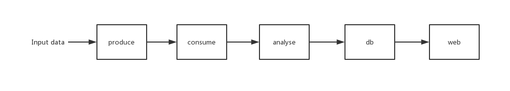

# bda-demo
A big data analytics demo

### 项目结构
```text
produce/ --生产者程序(Kafka)
consume/ --消费者程序(Storm/Spark streaming/单机消费者)
analyse/ --分析日志数据(HBase/HDFS)
db/      --数据库(MySQL)
web/     --Web(Grafana)

utils/   --通用代码(存放硬编码的URL, 配置等信息)
res/     --存放数据，文档，PPT等资源文件
```

### 数据流


### 导入
整个项目是个Maven项目，IDEA和Eclipse应该都能导入。

父项目下有几个子项目（模块），直接按处理流程分的，流程如上图

### HBase表设计
```text
|  rowkey   |         info        |                      ticket                     |     err      |
| --------- | ------------------- | ----------------------------------------------- | ------------ |
| dt&rowkey | req | res | success | mac | pcm | airport | airline | agent | country | errno | type |

```

### 部署
#### produce模块
可直接在本机IDE上运行，无需部署到虚拟机。
#### consume模块
首先使用以下命令初始化表
```shell
hbase shell
create 'Ticket', 'info', 'ticket', 'err'
exit
```
通过Maven命令`mvn clean compile assembly:single`打包，再发送到虚拟机运行。

如果出现utils包的依赖问题，是由于没有安装utils包到本机，需要在**父项目**下运行`mvn install`安装子模块。
#### analyse模块
使用`package`打包发送到虚拟机，再放到虚拟机的HDFS的`/lib`文件夹中，同时将依赖包`hbase-server-1.2.6.jar`也放入`/lib`

使用以下命令提交任务
```shell
spark-submit --class com.github.lvyilin.Analyser --master spark://cluster1:6066 --deploy-mode cluster hdfs:///lib/bdademo-analyse-1.0-SNAPSHOT.jar --jars hdfs:///lib/hbase-server-1.2.6.jar --executor-memory 256M --total-executor-cores 8
```
参数`--executor-memory`和`--total-executor-cores`可以根据本机的性能进行修改，或直接去除。
### 规约
- `res/`下放了一部分数据（200条），先用这个小数据测试
- `utils/`放硬编码的URL，魔法值，等，例如`172.18.0.2:9092`，每台机器IP不一样，放在一起好管理
- 命名风格等其他规约参考[阿里巴巴Java开发手册](https://github.com/alibaba/p3c/blob/master/阿里巴巴Java开发手册（详尽版）.pdf)